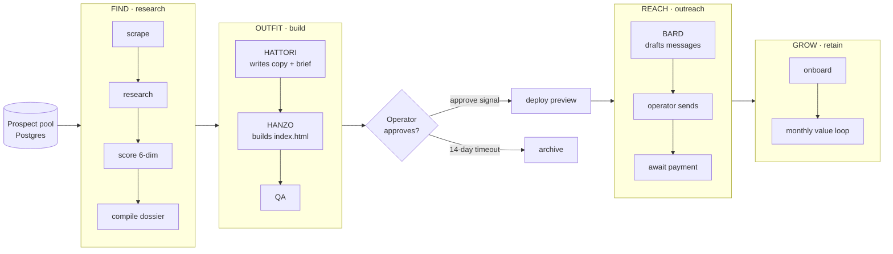

# FORGE Pipeline

A durable, agentic pipeline that discovers local-service-business prospects, builds each one a spec marketing website with an LLM agent, runs outreach, and onboards paying clients — orchestrated end to end with [Temporal.io](https://temporal.io).

## What it is

FORGE is a five-stage customer-lifecycle pipeline — **F**ind, **O**utfit, **R**each, **G**row, **E**mbark. It pulls a prospect from a pool, deeply researches the business, has a chain of LLM agents write copy and build a complete website from scratch, waits for a human to approve, then deploys and moves the prospect into outreach and retention. Workflow state lives in Temporal; business data lives in Postgres; creative work is done by agents that shell out to a capable model while analytical work runs on a cheap JSON-mode model.

> ⚠️ **This is an architecture reference, not a turnkey product.** It compiles and reads like production code, and the Temporal / Postgres / LLM core is real. But every outward-facing integration (scraping, research, email, payments, CDN, blob storage, notifications, messaging, deploy) sits behind a **stub adapter** that returns deterministic fake data. You will not get a real website built, a real email sent, or a real charge made until you implement those adapters yourself. See [Status / what's stubbed](#status--whats-stubbed).

## Pipeline at a glance

*(EMBARK — strategic self-improvement — is a future stage and is intentionally out of scope in this reference.)*

## Why it's interesting

- **Durable orchestration.** Temporal owns retries, timers, signals, and crash recovery. If the host dies mid-build, the workflow resumes from its last checkpoint. There is no hand-rolled state machine, outbox, scheduler, or dead-letter queue — Temporal already provides all of that.
- **LLM cost routing.** Creative work (writing copy, designing a site) goes to a capable model via the `claude` CLI at a flat subscription cost. Analytical work (research synthesis, scoring, QA) goes to a cheap JSON-mode model. One rule, applied everywhere: *creative → capable model, analytical → cheap model.*
- **Per-prospect agent workspaces.** Each creative agent is a template directory that gets copied into `data/workspaces/<slug>/<agent>/`. The agent runs there, reads its inputs and writes its outputs as files, and the workspace persists for auditing. Editing a template improves every future build without touching past ones.
- **Human-in-the-loop approval.** After a site is built, the workflow blocks on a Temporal **signal** (`approve`) with a 14-day `condition()` timeout. An operator reviews and approves (or rejects) from a dashboard before anything deploys. The approval gate is a durable timer, not a polling loop.

## Repository tour

| Path | What's there |
|---|---|
| [`docs/ARCHITECTURE.md`](docs/ARCHITECTURE.md) | Deep explainer: stages, the Temporal model, LLM routing, agents, adapters, the `forgeFindOutfit` worked example |
| [`docs/SETUP.md`](docs/SETUP.md) | Prerequisites and how to run the demo locally |
| [`docs/DESIGN-DECISIONS.md`](docs/DESIGN-DECISIONS.md) | The "why" behind the architecture, as generalizable rules |
| [`docs/stages/`](docs/stages/) | One page per stage (FIND / OUTFIT / REACH / GROW) |
| [`docs/agents.md`](docs/agents.md) | The template-vs-workspace pattern and the three agents |
| [`docs/schema.sql`](docs/schema.sql) | Postgres schema (prospects, artifacts, learnings, …) |
| `src/types.ts` | Shared domain types (`Prospect`, `Scoring`, `ArtifactKind`, …) |
| `src/workflows/` | Deterministic Temporal workflows (no I/O) |
| `src/stages/*/activities/` | Side-effecting activities, grouped by stage |
| `src/workers/worker.ts` | The Temporal worker that registers all activities |
| `src/client.ts` | Trigger client that starts a demo workflow |
| `src/shared/lib/` | `claude-max.ts`, `gemini.ts`, `postgres.ts`, `artifact.ts`, `workspace.ts` |
| [`src/shared/adapters/`](src/shared/adapters/README.md) | One interface per external service + stub implementations |

## Tech stack

- **TypeScript** (strict), Node 20+
- **Temporal.io** for durable workflow orchestration (`@temporalio/{workflow,activity,worker,client}`)
- **PostgreSQL** as the source of truth for business data (`pg`)
- The **`claude` CLI** for the creative agents (capable model, subscription auth)
- A **JSON-mode LLM** for analytical work (research synthesis, scoring, QA)

No web framework, no ORM, no message bus. Generated websites are raw HTML/CSS with no build step.

## Status / what's stubbed

The orchestration core is real and runs locally. Everything that would touch a paid third-party service is stubbed:

| Concern | State |
|---|---|
| Temporal workflows, activities, worker | Real |
| Postgres access, artifact store, status updates | Real |
| LLM runners (`claude-max.ts`, `gemini.ts`) | Real (need a `claude` CLI / API key to actually call out) |
| Agent template → workspace pattern | Real |
| Unit tests (tiering, HTML audit, DNC suppression) | Real — a representative subset, run in CI |
| Scraper, research, email, payments, CDN, blob, notify, messaging, deploy | **Stubbed** — see [`src/shared/adapters/README.md`](src/shared/adapters/README.md) |

Going live with any one service means implementing its interface and swapping a single export in `src/shared/adapters/index.ts`. Nothing else in the pipeline changes.

## Testing

`npm test` runs the Jest suite. This reference ships a representative subset that
covers the pure, deterministic logic: prospect tier scoring, the HTML technical
audit, and the fail-safe do-not-contact suppression check. CI runs the typecheck
and the suite on every push and pull request.

## License

MIT. See [`LICENSE`](LICENSE).
