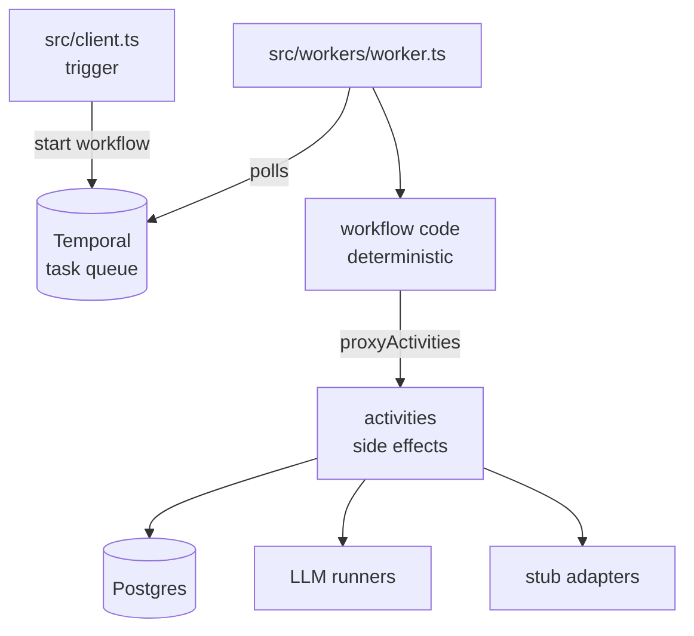
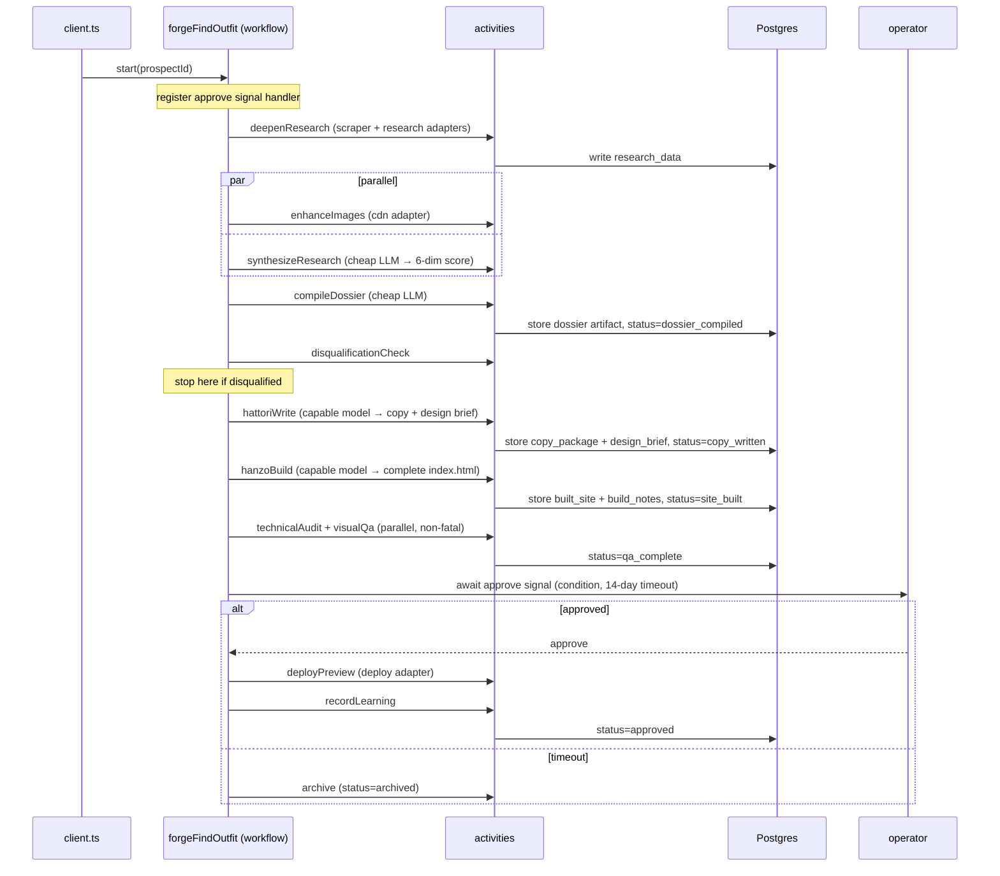

# Architecture

FORGE is a single TypeScript project that turns a list of local-service-business prospects into approved, deployed spec websites and then into outreach and paying clients. It is built on three load-bearing ideas:

1. **Temporal owns workflow state and durability.** Workflows are deterministic; all I/O happens in activities.
2. **Postgres owns business data.** No workflow state is duplicated into the database, and no business data is duplicated into Temporal history.
3. **The LLM work is routed by kind.** Creative work goes to a capable model; analytical work goes to a cheap model.

Everything else — the stages, the agents, the adapters — hangs off those three.

---

## The five stages

FORGE is the acronym for the five stages of the customer lifecycle. Each stage is a folder of Temporal activities.

| Stage | Job | Output |
|---|---|---|
| **FIND** | Discover and deeply research a prospect; score and compile a dossier | A normalized dossier + 6-dimension score in Postgres |
| **OUTFIT** | Write copy, build a complete website, run QA | A built `index.html` + artifacts, awaiting approval |
| **REACH** | Draft and send personalized outreach; await payment | An outreach record; a paid or archived prospect |
| **GROW** | Onboard and retain a paying client | Live site, recurring value loop |
| **EMBARK** | Strategic self-improvement (future, out of scope here) | — |

Each stage page in [`docs/stages/`](stages/) covers what it ingests, the activities involved, what it emits, and which adapters and LLMs it uses.

---

## The Temporal model: worker, workflow, activity

FORGE uses Temporal for durable execution. Three roles matter:

- **Workflows** (`src/workflows/`) are the orchestration logic. They decide *what happens in what order*. They are **deterministic**: no `Date.now()`, no `Math.random()`, no file or network I/O, no direct `console.log`. Temporal replays a workflow's code against its event history to recover after a crash, so any non-determinism would diverge from history and fail the replay. Workflows call activities through `proxyActivities`, never by importing the activity function directly (they `import type` only).

- **Activities** (`src/stages/*/activities/`, plus shared ones in `src/shared/activities/`) do *all* the side effects: database reads/writes, LLM calls, adapter calls, file I/O. Activities are where retries, timeouts, and heartbeats apply. They log via `log` from `@temporalio/activity` (replay-aware).

- **The worker** (`src/workers/worker.ts`) is the single process that hosts workflow code and registers every activity on a task queue (`forge-pipeline`). One worker runs the whole pipeline; there are no microservices.

- **The client** (`src/client.ts`) is what *starts* a workflow. The worker never starts workflows; the client (or a dashboard, or a schedule) does.



### Determinism and "don't rebuild what Temporal gives you"

Because Temporal already provides state persistence, retry-with-backoff, durable timers, signal-based human approval, queryable workflow state, and Continue-As-New, FORGE does **not** build any of: an event ledger, an outbox worker, a state machine, a scheduler, an approval table, or a dead-letter queue. If a piece of code starts to look like one of those, that's a signal it belongs in Temporal instead.

### Error classification

Every activity classifies its failures so Temporal retries the right things:

- **Non-retryable** (`ApplicationFailure.nonRetryable(...)`): deterministic failures that a retry can't fix — "prospect not found", "missing required input", "LLM produced empty/invalid output".
- **Retryable** (default, or `ApplicationFailure.retryable(...)`): transient failures — API timeout, rate limit, CLI crash.

You can see this in `src/shared/lib/workspace.ts` (`loadProspect` throws non-retryable when the row is missing) and `src/shared/activities/update-prospect-status.ts` (non-retryable when the prospect doesn't exist).

### Worker tuning note

The creative agents are memory-hungry (each spawns a full `claude` CLI session). The worker therefore caps activity concurrency, e.g. `maxConcurrentActivityTaskExecutions: 5`, so a burst of builds doesn't exhaust host memory. Long agent sessions heartbeat (see below) so Temporal doesn't mistake a slow build for a dead worker.

---

## LLM routing: creative → capable model, analytical → cheap model

This split is a core idea, not an implementation detail.

- **Creative work** — writing copy, designing and building a website, drafting personalized outreach — goes through `runClaudeMax()` in `src/shared/lib/claude-max.ts`. That helper spawns the `claude` CLI in the agent's workspace directory, lets it run a full agentic session, and reads back the files it wrote. It heartbeats every 30 seconds so a long session (a site build can run 15–30 minutes) is never mistaken for a crash. It strips `ANTHROPIC_API_KEY` from the child environment so the CLI uses subscription auth rather than a possibly-stale key.

- **Analytical work** — research synthesis, 6-dimension scoring, visual QA — goes through `src/shared/lib/gemini.ts`, which calls a cheap, fast JSON-mode model (`geminiJson` / `geminiVisionJson` / `geminiVisionText`). Any JSON-capable provider can back this surface.

The rationale: a flat-rate subscription model gives best-in-class creative output at zero marginal cost per prospect, while a cheap per-call model handles the dozen-plus structured analytical calls without bottlenecking on a single expensive model or sacrificing creative quality.

---

## The agent / workspace pattern

Each creative agent is **a template directory** checked into the repo, plus **a per-prospect workspace** created at run time.

- The template (`CLAUDE.md`, `SKILL.md`, references) is what you edit to improve the agent. Editing it affects all *future* prospects.
- At run time, `copyTemplate()` (`src/shared/lib/workspace.ts`) recursively copies the template into `data/workspaces/<slug>/<agent>/`. The activity writes the prospect-specific inputs (dossier, scoring, brief) into that workspace, calls `runClaudeMax({ workspacePath, ... })`, then reads the output files back and stores them as artifacts.
- Workspaces **persist** after the run for auditing — you can open `data/workspaces/<slug>/` and see exactly what the agent was given and what it produced. Everything durable also lives in Postgres, so a workspace can be deleted without losing pipeline records.

There are three creative agents — **HATTORI** (copywriter), **HANZO** (builder), **BARD** (outreach) — each documented in [`docs/agents.md`](agents.md).

---

## The adapter layer

Every outward-facing integration lives behind a small interface in `src/shared/adapters/index.ts`, with a stub in `stubs.ts` that returns deterministic fake data and logs a `TODO`. Activities only ever import from `index.ts`:

```ts
import { research, deploy } from '../../shared/adapters';
```

To go live with one service, implement its interface against a real provider and re-point one export. Nothing in the activities changes. The adapters are: `scraper`, `research`, `email`, `payments`, `cdn`, `blob`, `notify`, `messaging`, `deploy`. See [`src/shared/adapters/README.md`](../src/shared/adapters/README.md) for the interface-to-provider mapping. Note the `messaging` stub is intentionally a no-op — person-to-person outreach carries consent/compliance obligations and should only be wired against a compliant, opted-in channel.

---

## Postgres as the source of truth

Postgres holds business data that outlives any single workflow:

- **`prospects`** — the core entity: identity, contact info, the 6-dimension `scoring` JSONB, `tier`, pipeline `status`, and research payload. `src/types.ts` mirrors the columns the pipeline reads.
- **`artifacts`** — every meaningful pipeline output (dossier, copy package, built site, build notes, outreach drafts) stored hash-addressed by content. `storeArtifact()` (`src/shared/lib/artifact.ts`) makes writes idempotent on retry via `ON CONFLICT (content_hash)`, so a retried activity doesn't create duplicate rows.
- **`agent_learnings`** — append-only insights for later mining.

Access goes through a small pooled helper (`src/shared/lib/postgres.ts`: `query` / `queryOne`). The full schema is in [`docs/schema.sql`](schema.sql).

### Scoring and tiers

Each prospect is scored on six dimensions, 0–10, stored in `prospects.scoring`:

| Dimension | 0 | 10 |
|---|---|---|
| `website_quality` *(REVERSED)* | polished modern site | no website at all |
| `social_proof` | no reviews | many strong reviews |
| `contact_confidence` | no contact info | phone + email + owner + address |
| `market_opportunity` | saturated | high demand, few competitors |
| `business_maturity` | brand new | established, credentialed |
| `competitive_position` | strong competitors | weak/no local competition |

The reversal on `website_quality` is the most common gotcha: a business with *no* site is the *best* prospect, so it scores 10. Prospects bucket into **tiers 1–3** (3 = best). Six dimensions instead of one composite keeps the reasoning visible — two prospects can tie on total and need completely different pitches.

---

## The approval gate

After OUTFIT builds a site, the workflow does not deploy automatically. It blocks on a Temporal **signal**:

1. A signal handler (`approve`) is registered at the top of the workflow, before any activities run.
2. The workflow calls `condition(() => approved, '14 days')` — a durable timer. The host can restart and the timer survives.
3. An operator reviews the built site in a dashboard and sends the `approve` signal, or the 14-day window elapses.
4. On approval → the deploy activity runs (via the `deploy` adapter). On timeout → the prospect is archived.

The timeout is mandatory — a `condition()` without one would wait forever. This is the human-in-the-loop point: the first deploy/impression is too important to fully automate.

---

## Worked example: `forgeFindOutfit`

`forgeFindOutfit` runs FIND and OUTFIT in one workflow (they together take well under an hour, so one workflow keeps the history tidy; REACH and GROW are separate workflows because they span days/weeks and would otherwise bloat history with idle waiting).



Step sequence in prose:

1. **Deep research** pulls business data and credibility signals through the `scraper` and `research` adapters.
2. **Image enhancement** (`cdn` adapter) and **research synthesis** (cheap LLM, produces the 6-dimension score) run in parallel — they don't depend on each other.
3. **Compile dossier** (cheap LLM) normalizes everything into the one document downstream agents read; the result is stored as an artifact and status becomes `dossier_compiled`.
4. **Disqualification check** filters out do-not-contact / closed / existing-client prospects before any expensive creative work.
5. **HATTORI** (capable model) writes the copy package and a design brief; status → `copy_written`.
6. **HANZO** (capable model) reads the brief and copy, picks a reference template, and writes a complete `index.html` from scratch; status → `site_built`.
7. **QA** (technical audit + visual QA, cheap LLM) runs in parallel and is informational — failures are logged but never gate the workflow; status → `qa_complete`. QA runs as an informational second opinion, never a gate; see Design Decision 11 for why the earlier automated gate was removed.
8. The workflow **waits on the `approve` signal** (14-day timeout). Approve → deploy + record learning (`approved`). Timeout → archive.

REACH then runs as its own workflow: **BARD** drafts outreach, the operator sends it (`messaging`/`email` adapters), and the workflow waits on a payment signal (with its own timeout) before handing off to GROW.
